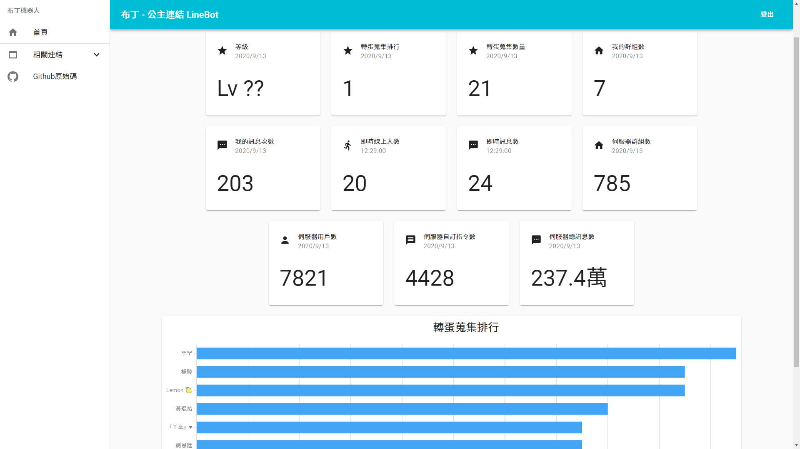
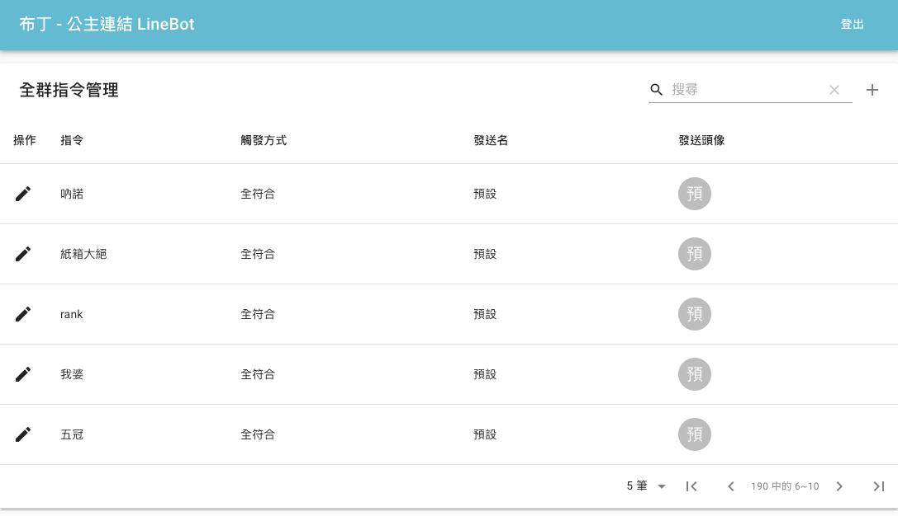
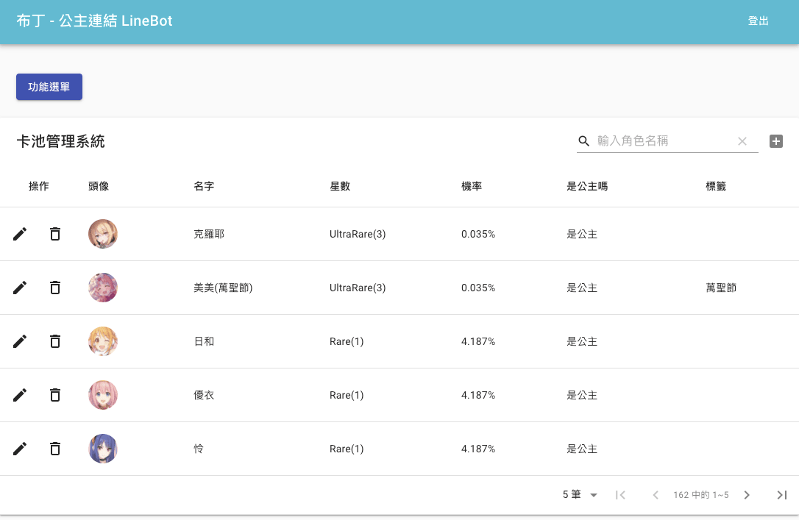

# 公主連結聊天機器人

本專案是基於框架[bottender](https://bottender.js.org/)進行實作，此框架特色

* 適用於多種臺灣常用聊天app ~~雖然我都沒有好友，只好寫機器人陪我聊天~~
* 框架已處理好不同平台的規則，無須因應各平台進行適應
* 開發過程協助分析每一動作的耗時，進行效能優化
* 因為他真的超好用der

## 目錄

- [公主連結聊天機器人](#公主連結聊天機器人)
  - [目錄](#目錄)
  - [使用須知](#使用須知)
  - [機器配置](#機器配置)
  - [目前適用聊天軟體](#目前適用聊天軟體)
  - [此專案特色](#此專案特色)
    - [各大遊戲性功能 - 管理員用](#各大遊戲性功能---管理員用)
    - [群組功能性 - 使用者用](#群組功能性---使用者用)
    - [公主連結資訊查詢 - 使用者](#公主連結資訊查詢---使用者)
  - [部分截圖](#部分截圖)
  - [事前準備](#事前準備)
  - [安裝方式](#安裝方式)
  - [進階用法](#進階用法)
  - [注意事項](#注意事項)

## 使用須知

本專案已配置好所有程式所需之環境，只需跟著[安裝方式](#安裝方式)，進行操作即可。

## 機器配置

此專案結合了 `docker-compose` 一鍵佈署的特性，使用了六台虛擬機器

|機器|image|說明|
|-|-|-|
|mysql|[mysql](https://hub.docker.com/_/mysql)|資料庫
|redis|[redis](https://hub.docker.com/_/redis)|記憶體快取資料庫
|app|[app](https://github.com/hanshino/redive_linebot/blob/master/app/Dockerfile)|`node.js:12-alpine` 包含主程式
|crontab|[crontab](https://github.com/hanshino/redive_linebot/blob/master/job/Dockerfile)|`node.js:12-alpine` 定時排程執行
|phpmyadmin|[phpmyadmin](https://hub.docker.com/r/phpmyadmin/phpmyadmin/)|`phpmyadmin` 資料庫管理|

可使用`docker-compose`指令水平擴展主程式，端看於個人硬體強度來做提升。

## 目前適用聊天軟體

* [Line](https://line.me/zh-hant/)

## 此專案特色

### 各大遊戲性功能 - 管理員用
* 抽卡模擬
* 資訊查詢（管理員自主設定指令）

### 群組功能性 - 使用者用
* 群組排行
* 群組設定（自定義功能開關）

### 公主連結資訊查詢 - 使用者
* 角色資訊查詢
* 戰隊報名管理
* 官方活動查詢


## 部分截圖





## 事前準備

* [Git](https://git-scm.com/)
* [Docker](https://www.docker.com/)
* [Line機器人申請](https://manager.line.biz/)，記下 Access Token & Client Secret

## 安裝方式

1. 打開你的CLI跟著我一起輸入(終端機、命令提示字元、命令介面)
2. `git clone https://github.com/hanshino/redive_linebot.git`
3. `cd redive_linebot`
4. `cp .env.example .env`
5. 編輯 `.env` ，請務必填上所有資訊並存檔！
6. `docker-compose up -d`
7. 此時電腦的 **80 port** 將會開啟服務，如無固定ip可用，可使用[ngrok](https://ngrok.com/)進行服務公開。
8. 網址預設為 `https://{your_domain}/webhooks/line`
9. 將網址填進 [Line Account Manager](https://manager.line.biz/)

## 進階用法
開啟多機器進行 `load-balance` (複載平衡)

```cmd
docker-compose up -d --scale app=3
```

以上的數字 `app=3` 可自由調整，輸入多少就會開啟多少機器

## 注意事項

* 要使用戰隊功能，需先跟 [Ian 戰隊系統作者](https://discord.gg/cwFc4qh)申請 Accesss Token
* `Windows` 作業系統使用 `Docker` 需注意開啟 `hyper-v` 是否會影響自己遊玩手機模擬器。
