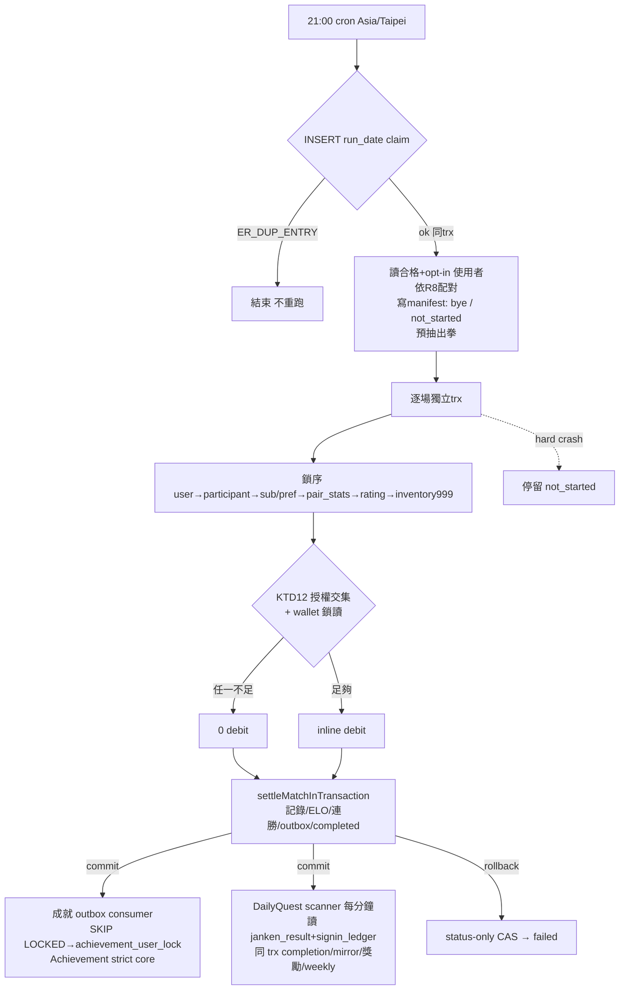
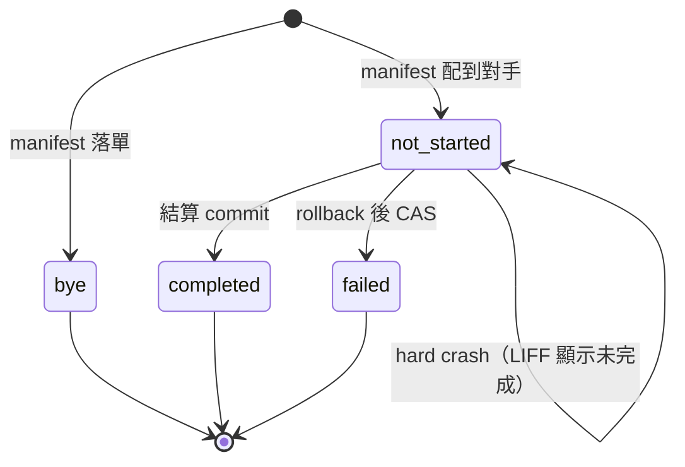

# 自動猜拳配對 - Plan

## Goal Capsule

- **目標（Objective）：** 新增一個獨立、預設關閉的每日自動配對機制，讓符合資格的訂閱者每天最多打一場全自動猜拳對戰；下注、ELO、連勝、每日獎勵等結算規則完全沿用既有手動對戰規則，不新增倍率，也不調整任何售價或福利額度。
- **產品範圍歸屬（Product authority）：** 本計畫僅涵蓋上述自動配對功能本身。世界王自動攻擊是本次討論過程中由使用者提出、明確列為後續規劃、非本階段範圍的項目——這個排除的出處是本次討論本身，不是既有 roadmap 文件；`docs/plans/2026-09-09-sponsorship-subscription-roadmap.md:120` 討論的其實是月卡福利候選項目（自動化升級、補簽容錯、永久收藏外觀），並未明確指名世界王自動攻擊，兩者不應混為同一出處。另外，自動配對本身就是一項新的訂閱福利，本計畫的目的正是新增這個福利，因此不屬於「排除福利變動」；本計畫排除的只是「其他既有福利項目調整」與「售價調整」，那兩者屬於 roadmap 階段 2（`docs/plans/2026-09-09-sponsorship-subscription-roadmap.md:115-127`）範圍，本計畫不觸碰。
- **待解封鎖項（Open blockers）：** 產品面決策（配對優先順序、錯過執行時段處理、對手身分展示範圍、任務／成就計入）已由使用者全數確認並整合進本文件。先前兩項設計 blocker（KTD7 distinct-feature 成就的 Redis→durable 遷移、KTD9 `daily_quest` cutover）**兩項協定已收斂並經覆核**：KTD7 採 per-(user, achievement) 懶遷移（觀測點＝成功交易內的唯讀 GET），KTD9 採「同表續算」單一 writer（`daily_quest` 加 nullable `quest_date`、`daily_quest_completion`／`daily_quest_weekly_claim`、operator 固定 D_c）。pla-1 已對全文做獨立實際驗收（conditional pass），所要求的三項精確文件修正已落；規劃面無剩餘設計阻塞，故 `artifact_readiness` 標為 `implementation-ready`——**這指文件完整可據以實作，不是實作、測試或部署已完成**。KTD9 所列 release gate 是「尚未執行的檢查」，不是設計 open question。另外，階段 1 驗收 gate（見「本計畫與既有文件的關係」）尚未通過，是本計畫開始實作前的既有前置條件，本次未變更也未代為勾選；UI designer mockup 與使用者核可、實際資料 preflight、release 核可亦全部保留，不代勾。
- **停止條件（Stop conditions）：** 實作代理人（`ce-work` 或人類）在階段 1 驗收 gate 尚未由非實作者覆核通過前，**必須停止、不得開始撰寫本計畫的任何實作程式碼**；也不得自行將階段 1 清單勾選為完成，不得宣稱已部署、已跑過測試或已通過驗收。KTD9 的 release 程序（停舊 writer、preflight、activation）與 KTD7 的舊 writer 退出確認屬於 release 期 gate，同樣不得由實作者代為宣告完成。

## Product Contract

### Summary

持有任何目前有效月卡或季卡（不分取得管道）的使用者，可以另外、獨立地開啟「自動配對」意願。開啟後，系統每天台灣時間 21:00 在全站範圍內，為所有符合資格且已開啟配對意願的使用者配對，每對雙方自動隨機出拳一次；只有當雙方都同意下注時，才依既有手動對戰的下注、ELO、連勝、每日獎勵規則結算，不新增任何倍率或優惠。

### Key Decisions

- **新增獨立同意，預設關閉。** 「是否參與自動配對」與「是否同意在自動配對中下注」是兩個新的、彼此獨立的偏好設定，與既有「被挑戰時自動出拳」（`auto_janken_fate`）偏好無關；持有後者不代表已同意前兩者。管轄 R2、R3。
- **結算規則不變。** 下注結算、手續費、ELO 變動、連勝／懸賞、每日獎勵，一律沿用既有手動對戰已經在用的同一套規則，自動配對不引入任何新費率或加成。管轄 R15。
- **失效後重新取得資格：恢復配對本身只需重新開啟配對意願，下注需另外重新同意。** 訂閱到期時，自動配對（含任何下注意願）立即停止。之後重新取得有效訂閱時，使用者只要重新開啟「參與配對」偏好，就能免費（不下注）恢復參與配對；若還想在配對中下注，才需要另外重新開啟「下注同意」偏好——兩者彼此獨立，不要求兩者都重新開啟才能恢復配對本身。若訂閱從未真正中斷（例如到期前已續期銜接、或退換卡期間仍有其他有效卡種持續覆蓋），不算資格中斷，兩個偏好都維持原狀、不需要重新同意。管轄 R4。
- **配對優先順序：昨日輪空者優先，其餘同下注意願優先，同條件隨機選對象。** 每次配對先保障「前一天輪空、今天依然符合資格且開啟配對意願」的使用者取得對戰機會；不論在此優先層級或一般層級，都先嘗試撮合下注意願相同的雙方，找不到同類對象才跨意願池配對；同一層級、同一分類中若有多名候選人都同樣符合條件，以隨機方式選出實際對象（session-settled: user-directed — 使用者選擇以「昨日輪空者優先＋同下注意願優先＋同條件隨機」作為配對排序依據，取代以 ELO／段位相近排序或單純先到先得）。管轄 R8、R9。
- **錯過 21:00 觸發＝當天跳過，整批不補配、不補打、不重啟已開比賽；已開始的每場獨立結清。** 若當天 21:00 排定的執行未能觸發，當天所有人皆無配對，不在其他時間點另行觸發配對。若已觸發、且部分場次已開始執行，每一場在自己的原子交易邊界內獨立判定：已完整跑完（debit/出拳/結算全部成功）的場次保留、視為當天已完成；未能在該場自己的交易內跑完的場次，不扣款、不產生戰績、也不算「輪空」（bye）——它單純是「該場次未完成」，不會被重啟或用另一次配對補打，該場的雙方仍計入當天已使用一次自動配對名額（不重新配對，見 R10）（session-settled: user-directed — 使用者明確以「已開始場次逐場獨立成敗、未完成不算 bye 不補打」取代整批畫一刀「全部視為未執行」或「未完成自動改判輪空」的做法）。管轄 R10。
- **對手身分僅顯示暱稱與頭像，且需於開啟配對前事先告知。** LIFF 結果頁只顯示配對到的對手的暱稱與頭像，不顯示 LINE UID、聯絡方式或所屬群組；使用者在開啟「參與配對」偏好之前，必須先被明確告知這兩項會展示給對手（session-settled: user-directed — 使用者明確指定展示範圍以暱稱與頭像為限，並要求開啟前事先告知，取代不告知或展示更多／更少身分資訊的做法）。管轄 R5、R16。
- **自動配對場次仍計入既有每日任務與成就，沿用既有觸發條件，不新增條件、不群組通知；已完成場次的任務/成就獎勵允許延後或隔日補處理，不算「補打對戰」。** 這只補齊既有系統對自動配對場次的涵蓋範圍，不改變任何任務／成就本身的判定條件（session-settled: user-directed — 使用者明確確認自動配對場次需與手動對戰同等計入既有每日任務與成就，且獎勵發放時間可延遲，不視為對本計畫「不補打對戰」承諾的例外）。管轄 R17。
- **不下注場次（含現行 `nonBetK=0`）不更新連勝／懸賞，也不計入猜拳每日排名獎勵資格；猜拳每日排名獎勵本身目前是關閉的（`enableDailyRankReward: false`），本計畫不開啟它。** 這是既有手動對戰規則的延伸適用，不是自動配對新增的限制（session-settled: user-directed — 使用者明確排除本計畫自行開啟現行為 `false` 的每日排名獎勵旗標）。管轄 R15。

### Requirements

**資格與同意**

- R1. 使用者只要持有目前有效的月卡或季卡即符合自動配對資格，不分取得管道（持續有效的續期、女神石購卡、現金贊助發出的序號兌換等）一律同等對待。
- R2. 「是否參與自動配對」由一個獨立的開關控制，與既有「被挑戰時自動出拳」（`auto_janken_fate`）偏好各自獨立；預設為關閉。
- R3. 「是否同意在自動配對中下注」由另一個獨立的開關控制，與是否參與配對本身分開設定；使用者可以只開配對、不開下注同意。
- R4. 訂閱到期時，該使用者的自動配對與任何下注同意立即停止生效。之後重新取得有效訂閱時，恢復參與配對只需要重新開啟「參與配對」偏好即可（可先免費、不下注參與）；若要在配對中下注，需另外重新開啟「下注同意」偏好——不要求兩者同時重新開啟才能恢復配對本身。若中途未真正中斷有效性（例如提前續期銜接、或退換卡期間仍被其他有效卡種持續覆蓋），不視為資格中斷，兩個偏好都不需要重新同意。
- R5. 使用者在開啟「參與配對」偏好之前，介面必須明確告知：一旦配對成功，其暱稱與頭像會依 R16 所定範圍展示給配對到的對手；使用者確認之後才能實際開啟該偏好。

**配對**

- R6. 配對每天執行一次，時間為台灣時間（Asia/Taipei）21:00，範圍是全站（不侷限於單一群組），涵蓋當下符合資格（R1）且已開啟配對意願（R2）的所有使用者。
- R7. 每位符合資格且已開啟配對意願的使用者，透過這次每日配對最多只會被配對進一場自動對戰。這個「每日一場」上限只約束自動配對，不影響、也不限制手動（玩家自行發起）對戰的場數。
- R8. 配對依下列優先順序進行：（一）前一天輪空、且今天依然符合資格與已開啟配對意願的使用者，優先於今天才符合條件的一般使用者取得配對機會；（二）不論在優先層級或一般層級內，都先嘗試撮合下注意願相同的雙方（都想下注，或都不想下注），同層級內同下注意願的候選人用盡、找不到同類對象時，才跨下注意願配對剩下的人；（三）同一優先層級、同一下注意願分類中，若有多名候選人都同樣符合配對條件，以隨機方式選出實際配對對象。此順序確保沒有已開啟配對意願的合格使用者，僅因找不到同下注意願對象而完全配不到。
- R9. 當天配對後仍落單（人數為奇數，或找不到對象）的使用者，該次不扣款、不產生對戰結果或戰績紀錄，但需要有一個可在 LIFF 顯示的「今日輪空」狀態可查（此狀態本身不是對戰紀錄，不影響戰績與 ELO）。若該使用者在次日配對時仍然符合資格且仍開啟配對意願，依 R8 第（一）項取得次日優先配對權；此優先權僅涵蓋次日這一次配對，不會因連續落單而疊加或往後累積更高優先權，每天的優先順序都依 R8 重新判定。
- R10. 若當天 21:00 排定的配對未能觸發，當天全體視為跳過：不在其他時間點另行觸發配對，也不在 21:00 排定時段之外執行任何自動下注；LIFF 顯示「今日未執行」狀態，與「今日輪空」（R9，找不到對象）為不同狀態。若當次已觸發、其中部分場次已進入自己的處理流程，每一場獨立以自己的原子交易邊界判定成敗：完整跑完的場次視為當天已完成並保留其結果；未能在該場自己的交易內完整跑完的場次不扣款、不產生戰績，且**不是**「今日輪空」（bye）狀態——它是另一種獨立狀態（未完成／failed），該場雙方仍計入當天一場上限（R7），不會被重新配對或另外補開一場來取代它。LIFF 需要能區分「今日未執行（整批未觸發）」「已規劃但未完成／failed（該場自己未跑完）」「今日輪空／bye（真正找不到對象）」「已完成」四種狀態，不能把後三者混報成同一種「今日未執行」。

**自動出拳與下注**

- R11. 配對成功的雙方，各自的出拳選擇都是系統自動隨機決定並送出的，沿用既有猜拳的送出與判定流程。
- R12. 只有當配對雙方都已開啟「下注同意」（R3）時才會下注；只要有一方沒有開啟下注同意（含 R8 第（二）項的跨意願配對），該場就不下注。
- R13. 當雙方都同意下注時，實際下注金額採「雙方各自設定的下注上限中較低者」，並且不得超過雙方既有段位所對應的下注上限（與手動對戰已經在用的段位上限規則相同）中較低者。
- R14. 若依 R13 算出的下注金額，任一方的女神石餘額不足以支付，則整場對戰改為不下注進行（不是降低金額改成雙方都付得起的金額），對戰本身仍然照常進行，並仍計入該使用者當天的自動配對一場上限（R7）。
- R15. 自動配對對戰的勝負判定、ELO 變動、連勝／懸賞效果、每日獎勵資格，一律比照既有手動對戰的規則結算，不為自動配對另外設計任何新費率、倍率或加成；不下注場次（含 R12/R14 導致的不下注）比照現行 `nonBetK=0` 設定不更新 ELO，也不更新連勝／懸賞，且不計入猜拳每日排名獎勵資格；猜拳每日排名獎勵旗標（`enableDailyRankReward`）目前為關閉狀態，本計畫不開啟它。

**任務與成就**

- R17. 自動配對對戰比照手動對戰，計入既有每日任務（簽到＋猜拳雙條件的每日/每週獎勵）與既有猜拳相關成就的判定，沿用既有觸發事件與條件，不新增條件、不新增判定邏輯；自動配對本身不因此另外發送任何 LINE 群組訊息或通知。已完成場次的任務／成就獎勵，允許延後至同日稍後或隔日批次處理，不因處理延遲被視為「補打對戰」（R10 的「不補打」僅指不會為了補償未完成或未執行的場次而重新配對或重新出拳）。

**可見性**

- R16. 自動配對對戰的結果（勝負、下注金額（若有）、結算內容，以及當天輪空或未執行時的狀態與原因）只在使用者自己的 LIFF 頁面顯示；其中對手身分僅以暱稱與頭像呈現，不揭露 LINE UID、聯絡方式或所屬群組等其他個人資訊。自動配對不會發送任何 LINE 群組訊息或廣播，符合本專案既有「個人狀態不進群組訊息」的原則。

### Key Flows

- F1. 每日自動配對執行
  - **觸發：** 每天台灣時間 21:00 排程觸發。
  - **參與者：** 排程執行者；所有當下符合資格且已開啟配對意願的使用者。
  - **步驟：** 若當次 21:00 觸發本身未成功發生，當天全體視為跳過，LIFF 顯示今日未執行（R10），流程結束 → 否則，收集當天尚未配對過的合格且已開啟配對意願的使用者 → 依優先順序配對：前一天輪空者優先 → 同下注意願優先、找不到同類才跨意願池 → 同條件隨機選對象（R8）→ 對每一對各自在獨立的原子交易邊界內：判斷是否下注與下注金額（R12–R14）→ 雙方自動隨機出拳（R11）→ 依既有結算規則判定並記錄結果、更新任務／成就進度（R15、R17）→ 寫入僅 LIFF 可見的結果，對手身分僅顯示暱稱與頭像（R16）→ 該場交易未能完整跑完時標記為「未完成／failed」而非輪空，不重試、不重新配對（R10）→ 落單者標記為當天輪空（bye）狀態，不扣款、不留戰績，並依 R8、R9 取得次日優先權。
  - **涵蓋：** R6、R7、R8、R9、R10、R11、R12、R13、R14、R15、R16、R17。
- F2. 訂閱到期與重新取得資格
  - **觸發：** 使用者的有效訂閱到期，或使用者在中斷後重新取得有效訂閱。
  - **參與者：** 訂閱者本人；每日配對執行流程。
  - **步驟：** 到期當下，資格檢查（R1）即排除該使用者，不再參與配對。之後重新取得有效訂閱時，配對偏好與下注同意偏好都回到「需要使用者重新開啟」的狀態；使用者只重新開啟配對偏好即可恢復免費參與，需另外重新開啟下注同意才能恢復下注（R4）。若中途從未真正中斷有效性，此流程不觸發，兩偏好維持原狀。
  - **涵蓋：** R1、R4。

### Acceptance Examples

- AE1. **涵蓋 R8、R11。** 兩位符合資格且已開啟配對意願的一般使用者（皆非前一天輪空），雙方下注同意皆為關閉；配對後兩人依同下注意願撮合成功，雙方各自隨機出拳，過程中沒有任何女神石被扣留或轉移（除既有平手／不下注結算路徑外）。
- AE2. **涵蓋 R13。** 使用者甲自訂下注上限 500、段位上限 1000；使用者乙自訂下注上限 2000、段位上限 300；雙方都同意下注時，實際下注金額為 300（先取雙方自訂上限中較低者 500，再取雙方段位上限中較低者 300，兩者中取更嚴格的 300）。
- AE3. **涵蓋 R14。** 雙方都同意下注、依 R13 算出應下注 1000，但乙的女神石餘額只有 400；結算時雙方都不下注，對戰仍照常進行，仍計入雙方當天一場上限，且雙方餘額都不因這次下注判斷而變動。
- AE4. **涵蓋 R8。** 使用者甲昨天輪空、今天依然符合資格且開啟配對意願；使用者乙、丙皆為今天才符合條件的一般使用者，且與甲下注意願相同、都可作為甲的候選對象。配對時，系統優先為甲安排配對，並在乙、丙同樣符合條件時，以隨機方式從兩人中選出甲的實際對手。
- AE5. **涵蓋 R8、R12。** 前一天輪空的使用者甲今天依然符合資格且開啟配對意願，但當天找不到任何與甲下注意願相同的候選對象；系統改為將甲跨下注意願池配對一位對象，該場依 R12 判定為不下注。
- AE6. **涵蓋 R9。** 當天符合資格且開啟配對意願的使用者為奇數，配對完成後恰有一人落單，該次不扣款、不產生對戰紀錄，但該使用者可在 LIFF 看到當天輪空狀態；若該使用者次日仍符合資格且仍開啟配對意願，依 R8 取得次日優先配對權，但若次日又再度落單，優先權不會因此疊加，仍依 R8 重新判定。
- AE7. **涵蓋 R4。** 使用者的訂閱到期後，之後透過新的兌換重新取得有效訂閱；只要該使用者重新開啟「參與配對」偏好，即可恢復免費（不下注）參與自動配對，不需要同時開啟下注同意；若要恢復下注，需另外重新開啟下注同意偏好。
- AE8. **涵蓋 R1。** 三位使用者分別透過「持續有效的續期」「女神石購卡」「現金贊助序號兌換」取得目前有效的月卡或季卡；每日配對資格檢查時，三人一視同仁，不因取得管道不同而有差別待遇。
- AE9. **涵蓋 R7。** 使用者今天已經被自動配對過一場；同一天內若配對流程被重新觸發或重試，該使用者不會被再次配對，也不會被再扣一次款。
- AE10. **涵蓋 R10。** 當天 21:00 排定的配對因主機故障未能觸發；當天視為跳過，沒有任何使用者被配對，也沒有任何自動下注發生，LIFF 顯示「今日未執行」狀態；隔天排程正常執行時，才依當天的資格與意願重新配對，系統不會為了補償錯過的一天而在非排定時段另行觸發配對。
- AE11. **涵蓋 R5、R16。** 使用者尚未開啟「參與配對」偏好；當使用者要開啟該偏好時，介面明確告知配對成功後其暱稱與頭像將展示給配對到的對手，且不會展示 LINE UID、聯絡方式或所屬群組。使用者確認開啟後，往後配對結果的 LIFF 頁面僅顯示對手暱稱與頭像，不包含前述其他個人資訊。
- AE12. **涵蓋 R16。** 一場自動配對對戰結算出勝、負或平手結果後，結果只出現在雙方各自的 LIFF 頁面，不會有任何訊息發送到任何 LINE 群組。
- AE13. **涵蓋 R10。** 21:00 排程正常觸發，其中一對已完成扣款與出拳、但在寫入結算結果前流程中斷；重啟後該對不會被重新配對或重新出拳，其原始交易若未提交則視為未完成／failed（不扣款、不留戰績），若已提交則保留為已完成——兩者都不是「今日輪空」，且雙方當天一場上限已用掉，LIFF 顯示對應的「未完成」或「已完成」狀態而非「今日未執行」。
- AE14. **涵蓋 R17。** 一場自動配對對戰完成後，参與雙方的每日任務進度（簽到＋猜拳雙條件）與相關成就判定，比照當天手動對戰的方式更新；若當下獎勵發放因批次時間延遲到隔天處理，仍視為當天完成的任務，不是「補打對戰」。

### Scope Boundaries

- 世界王自動攻擊——本次討論中由使用者提出、明確排除於本階段之外；此項不歸因於既有 roadmap 文件，roadmap 文件中對應段落討論的是其他福利候選項目，並未指名世界王自動攻擊。
- 訂閱卡其他既有福利項目與售價調整——排除於本計畫外，屬於 `docs/plans/2026-09-09-sponsorship-subscription-roadmap.md:115-127` 所述的 roadmap 階段 2 範圍；但本計畫本身要新增的「自動配對」正是一項新的訂閱福利，這是本計畫的目的之一，不在排除之列。
- 手動（玩家自行發起）對戰的行為、其下注上限、ELO 公式、連勝／懸賞規則、每日獎勵發放邏輯——維持不變；本計畫只新增一個會沿用既有結算規則的新觸發來源。
- 個別自動配對結果的群組公開通知——不在範圍內；結果僅 LIFF 可見（R16），符合本專案「公開狀態與個人狀態不可混雜於群組訊息」的原則。
- 在 21:00 排定時段之外，為了補償錯過的一天而另行觸發配對或自動下注——明確排除，見 R10；已觸發批次內對單一場次的原子交易安全復原不屬於此排除範圍。
- 揭露超出 R16 所定範圍（暱稱、頭像）的對手個人資訊（例如 LINE UID、聯絡方式、所屬群組）——不在範圍內，見 R5、R16。
- 任何新的手續費率、ELO 倍率或自動配對專屬加成——本計畫不引入，R15 明訂結算比照既有手動對戰規則。
- 開啟目前關閉中的猜拳每日排名獎勵旗標（`enableDailyRankReward`）——不在本計畫範圍內，見 R15。
- 全域 wallet／inventory 其他消費路徑的一般性重構——不在本計畫範圍內；本計畫只針對猜拳相關（含手動對戰 escrow 的局部扣款防護、共用結算 core 與獎勵發放）的交易與冪等問題做局部改動（見 Planning Contract KTD3、KTD6、KTD8）。
- 新增或補發任何無法安全判定的歷史任務／成就獎勵——不在範圍內，見 Planning Contract KTD7、KTD9（切換本身不得新增漏獎；D_c 之前的 legacy 週獎與 TTL 已遺失的 distinct membership 一律不反推、不 backfill）。

### Outstanding Questions

**已於 Planning Contract 解決（保留原題號供追溯，不再視為未決）：**

- Q1. R13 的段位下注上限為 0 的邊界——已由 KTD3「wallet authority 與下注金額」小節解決：段位上限 0 是合法值，不得用 `||` 之類的 falsy fallback 取代；計算結果不是正整數即整場不下注、不扣款，不新增任何產品承諾。
- Q2. 判斷「訂閱是否曾經真正中斷過」的具體方式——已由 KTD11 解決（兌換交易內以同一個固定 `now` 對所有 month/season 卡種聯集判斷 `start_at <= now < end_at`，兌換前無、兌換後有才視為 inactive → active）。
- Q3. R8 第（三）項「同條件隨機選對象」的亂數來源與可重現性——已由 KTD15 解決（可注入的純 RNG 與時鐘，預設 `Math.random` 與系統時間，測試注入固定序列）。

## Planning Contract

**Product Contract preservation note（事實陳述，非「未改動」宣稱）：** 本節 Key Technical Decisions 是「怎麼做」的實作機制選擇，不改寫 Product Contract 的 R/AE ID 編號，也不在本節重述產品規則全文；凡與 Product Contract 有交集之處一律以「管轄／涵蓋」引用 R-ID。本輪規劃對 Product Contract 實際做過以下變更，皆已由使用者核可：（一）R10 由「整批視為未執行」改為「已開始場次逐場獨立成敗、完整跑完者保留、未完成不算 bye 不補打」；（二）R15 澄清不下注場次（含 R12/R14 導致）的免費語意——不更新 ELO、連勝／懸賞，不計入每日排名獎勵資格；（三）新增 R17 與對應的 AE13、AE14（任務／成就計入、逐場 failed/completed 的驗收例）。除上述三項外，其餘 R/AE 內容未動。本輪 KTD5／KTD7／KTD9 的技術路線變更（DailyQuest 改為直接掃描既有 `signin_ledger`／`janken_result` 而不新增 condition 表與 daily outbox；distinct-feature 成就改為懶遷移）**不減少任何產品功能**：R17「自動配對計入每日任務與成就、允許延後處理」的意思不變，只是達成路徑改變。唯一經核可的 scope 差異在 KTD5 明列（補簽不計入每日任務；跨日延後處理的事件歸原日結算）。

### Key Technical Decisions

- KTD1. **每日配對用 `run_date` 為主鍵的 durable claim，一般 `INSERT` 搶佔。** 新表以 `run_date`（`DATE`，Asia/Taipei 日曆日）為主鍵，worker 啟動時執行不帶 `ON DUPLICATE KEY UPDATE` 的普通 `INSERT`；撞主鍵得到 `ER_DUP_ENTRY` 即代表當天已在跑或跑過，直接結束、不重新配對。不依賴 `ROW_COUNT()`／affected-rows 語意。這是 R6「每天一次」與 R10「錯過即跳過、不補跑」的技術落地點。（session-settled: user-approved — 以 durable claim 取代 Redis escrow 回補／log 防重；Redis 無法在 crash 後保證「當天是否已跑」這個全域事實。）管轄 R6、R7、R10。
- KTD2. **配對決策在 claim 同一交易內產生不可變的 participant manifest；狀態由 manifest 寫入時直接決定 `bye` 或 `not_started`，之後只單向推進。** claim 成功後，在同一交易內讀出合格（R1）且已開啟配對意願（R2）的使用者、依 R8 算出配對，寫入 `(run_date, user_id)` 主鍵的 participant 表：每列固定 `match_id`、角色（p1/p2）、對手 `user_id`、寫入當下的下注意願與上限快照（KTD12）、以及**雙方預先抽好的出拳選擇**。manifest 一旦寫入即不可變：對手、角色、出拳都不因 worker 重啟或交易重試而重抽。狀態語意：
  - 真正落單者在 manifest 寫入當下即為 `bye`（不是先 `not_started` 再改）；配到對手者為 `not_started`。
  - `completed` 與該場結算在**同一個 commit** 內寫入（KTD3），不存在「結算已提交但狀態未更新」的視窗。
  - 該場交易被 catch 到並 rollback 後，用一支**極短的 status-only CAS**（`UPDATE ... SET status='failed' WHERE match_id=? AND status='not_started'`）標記 `failed`；這支 CAS 不含任何金流。
  - hard crash（連 CAS 都沒跑到）的場次停留在 `not_started`；LIFF 對 `not_started` 與 `failed` 一律顯示「未完成」，兩者都不是 `bye`、也都不會被重啟補打（R10）。

  管轄 R7、R8、R9、R10、R11。
- KTD3. **單一共用結算 core `settleMatchInTransaction(trx, ...)`：不自己開交易、不碰 Redis／LINE／Bottender context；手動 `resolveMatch` 變成開交易的 wrapper，自動配對 inline 呼叫。**
  - **core 邊界：** 出拳判定、debit（若需要）、payout／refund、`JankenRecords`／`JankenResult` 寫入、ELO、連勝／懸賞、`janken_pair_stats`、participant `completed`、outbox（KTD4）全部在傳入的同一個 `trx` 內完成；core 不呼叫 `mysql.transaction`、不碰 Redis、不發 LINE 訊息、不讀 context。既有 `resolveMatch`（`app/src/service/JankenService.js:370-471`）目前是多段獨立交易（`updateElo`／`updateStreaks` 各自 `mysql.transaction`，`JankenRecords.create`／`JankenResult.insert` 走全域連線）並夾雜 Redis 操作；本計畫將它改為「開 `trx` → 呼叫 core → commit 後才做 Redis 清理（escrow zRem、choice del、resolve lock）與既有 EventCenter producer」的 wrapper，對外簽名與回傳值不變。
  - **funding 模式：** core 接受 `funding: "pre_escrowed" | "inline"`。手動對戰的下注在玩家出拳時已由 escrow 扣過（`pre_escrowed`），core **不得二次扣款**，只做 payout／refund；自動配對沒有玩家點擊視窗，在同一 `trx` 內 inline 對雙方 debit 再結算（`inline`）。
  - **事件產生：** 自動配對只寫成就 outbox（KTD4：`janken_win`／`janken_challenge`），不推 Redis EventCenter、不呼叫 `AchievementEngine.evaluate`。每日任務不需要任何事件：core 在同一 `trx` 內寫入的 `janken_result` 列本身就是 KTD5 scanner 讀取的 durable 條件。手動 wrapper 在 commit 後保留 controller 層的 `AchievementEngine.evaluate(janken_win / janken_challenge)`（`JankenController.js:321-327`、`:503-509`）通知路徑不變；既有 `EventCenterService.add(daily_quest)`（`JankenService.js:445-446`）依 KTD9 在 cutover 同一 commit 移除。
  - **models optional trx：** `JankenRecords.create`／`update`、`JankenResult.insert` 目前直接用全域 `mysql(TABLE)`（`app/src/model/application/JankenRecords.js:40-48`、`JankenResult.js:29-37`），需補 optional `trx` 參數；`JankenRating.findOrCreate` 等已支援者沿用。不傳 `trx` 時行為不變。
  - **owner 與回歸：** `JankenService.js` 的全部寫入面改動集中在 U3；U3 完成條件包含手動 duel 與 arena 兩條既有路徑的回歸測試綠燈。

  **wallet authority 與下注金額（解 Q1）：** 餘額的唯一權威是 `trx("inventory")` 上帶鎖的加總讀取；既有 `inventory.getUserOwnCountByItemId`（`app/src/model/application/Inventory.js:95-105`）走全域連線、不在交易內，**不能直接宣稱它是安全的**，需新增或改為接受 `trx` 的鎖讀版本。候選金額 `candidate = min(甲快照上限, 甲即時上限, 乙快照上限, 乙即時上限, 甲段位上限, 乙段位上限)`；**餘額不進 `min`**——`candidate` 算出後分別檢查雙方鎖讀餘額 ≥ `candidate`，任一方不足即整場 0 debit（R14），不降額。段位上限 0 是合法值，不得寫成 `rankCap || fallback`；`candidate` 不是正整數即不下注。KTD12 的授權交集只能讓 `candidate` 變小，不能變大。

  **鎖序（所有相關 Janken 路徑一致，逐列 `await`，不用 `Promise.all` 同時取鎖）：** ① `user` 兩列依 `user_id` ASC → ② participant 兩列 → ③ `subscribe_user`／`user_auto_preference` → ④ `janken_pair_stats`（canonical `orderedPair`，`JankenService.js:40`）→ ⑤ `janken_rating` 兩列依 `user_id` ASC → ⑥ `inventory` `itemId=999` 的範圍鎖依 `user_id` ASC。現行 `updateStreaks`／`updateElo` 對 `janken_rating` 是 `Promise.all` 且依「呼叫方 p1/p2 順序」取鎖（`JankenService.js:239-241`、`:517-520`），與 `pair_stats` 的字典序不是同一約定——U3 統一改為上述鎖序並盤點 duel／arena 既有呼叫方一起改，不留新舊路徑不同鎖序的死鎖組合。手動對戰的 escrow 扣款路徑同樣改為在交易內鎖 `user` + wallet 後重讀再 debit；Redis stale escrow 的退款 cron 在退款前需檢查 durable `JankenRecords` 是否已 settled，已 settled 不退。**仍 deferred 的已知 gap：** 手動路徑「DB debit 已 commit → Redis escrow tracking 寫入」之間的 crash 視窗，本計畫不宣稱全部解決，只縮小到上述兩個防護。

  **有界重試：** 只對 deadlock／lock-wait 錯誤、只在同一場執行嘗試內重試，重跑交易本身而不重抽 manifest 已固定的對手／角色／出拳；次數上限比照 `SubscribeController.EXCHANGE_MAX_ATTEMPTS`（`app/src/controller/application/SubscribeController.js:164`）的風格。（session-settled: user-approved — 自動配對不使用手動對戰的 Redis escrow。）管轄 R4、R7、R11、R12、R13、R14、R15。
- KTD4. **猜拳專屬成就 outbox（只承載成就事件），與結算同交易寫入；consumer 逐列 `FOR UPDATE SKIP LOCKED` → achievement mutex，效果與 processed 同交易，失敗 throw 回 pending 可觀測。** outbox 唯一鍵 `(match_id, role, event_name)`，`event_name` 只有既有成就事件名 `janken_win`／`janken_challenge`——之所以含 `role`，是因為 p2 勝出時 p2 同時會有 `janken_win`（勝者）與 `janken_challenge`（被挑戰者）兩個事件。**不再有 `daily_quest` outbox 事件**：每日任務由 KTD5 scanner 直接讀 `janken_result`，不需 handoff、不需等待條件齊備。每列含 `run_date`（該場所屬台灣曆日）、`occurred_at`、下游所需最小快照（userId、結果、streak、feature），不含任何成就條件。consumer：`SELECT ... FOR UPDATE SKIP LOCKED` 取一列 → 進入 KTD6 strict core（core 內自行 ensure＋鎖 `achievement_user_lock`）→ 同交易寫 `processed_at`；任何錯誤 `throw` 讓交易 rollback，列回到 pending 並累加 `attempts`／`last_error` 供 backoff 與觀測，**不永久丟棄**。跨日處理時一律以列上的 `run_date`／`occurred_at` 歸屬，不用處理當下時間（KTD10）。drainer 不建立對戰、不扣款、不發任何 LINE 訊息。管轄 R17。
- KTD5. **DailyQuest 改為「掃描既有 durable 來源 + 同表續算」：不新增 condition 表、不新增 daily outbox、不依賴 Redis；單一 writer 在同一 trx 內寫 completion／dated mirror／獎勵／weekly claim，持有與 KTD6 同一把 `achievement_user_lock`。** 現行 `app/bin/DailyQuestProcess.js` 每分鐘 `rPop` 清 Redis 佇列（payload 只有 `userId`、無日期），以處理當下的 today 評估 `signin_ledger.signin_date`（不分 source）與 `janken_result.created_at`（`:100-116`），daily 列與 daily 獎勵同 trx（`:70-84`）但 weekly 在 trx 外（`:86-97`）；`daily_quest` 表無 `quest_date` 與 unique。新設計：
  - **Durable 條件就是既有來源表：** `signin_ledger`（一天一列、`signin_date` DATE、`source ∈ {normal, makeup}`，`app/migrations/20260807085854_create_signin_ledger.js`）與 `janken_result`（`created_at`，由 KTD3 core 同 `trx` 寫入，手動／arena／自動三路徑同一種事實）。兩者都已在來源交易內持久化，legacy 漏獎只來自「undated queue＋以處理日評估」，不是缺事實。
  - **資格謂詞（參數化日期 d，TPE）：** `signin_ledger.user_id=? AND signin_date=d AND source='normal'` ∧ `janken_result.user_id=? AND created_at ∈ [d 00:00, d+1 00:00)`（+08 半開區間，不用 `moment().endOf("day")`）。`source='normal'` 是既有欄位；不能改用 `DATE(created_at)=d`，因為正常簽到交易可能跨午夜 commit。**語意說明（不宣稱零改）：** 既有正常簽到資格完全保留；補簽（`SigninService.makeup`，只能補 `date < today` 且同月，`SigninService.js:117-119`）在 legacy 下因只能補過去日期而事實上從不計入每日任務，新謂詞把這件事顯式化，不追溯發獎；**新增的差異**是「d 當日完成、跨日才處理」的事件 legacy 會丟棄（處理日≠d），新 scanner 會按 d 結算——這是可靠延後處理，屬已核可 scope（R17 允許延後、KTD10 歸原日）。
  - **Schema（最低限）：** `daily_quest` 新增 `quest_date DATE NULL`（只給新 mirror 列填日期，不加 unique、不覆寫舊列）；`daily_quest_completion` PK `(user_id, quest_date)`；`daily_quest_weekly_claim` PK `(user_id, week_start)`（TPE 週日為週首）；`daily_quest_bridge_state`（單列：`since_date`＝operator 選定的 D_c、`activated_at`）；`daily_quest_legacy_queue_archive`（`raw`、`captured_at`，受保護、不 log）。日期 authority 統一為 `COALESCE(quest_date, DATE(created_at))`，writer、weekly 計數與 UI（KTD10）共用。
  - **Scanner 遍歷：** 每分鐘對 ∀d ∈ [D_c, today]、以 `janken_result(created_at, id)` keyset 逐日走訪持久列，取 distinct user 後 join `signin_ledger` 謂詞，再排除已有 `completion`——**不是**只掃近 N 日、不依賴 wake users、不讀 Redis；late arrivals（跨日、多日 outage）自然落在窗內。索引：`janken_result(created_at, id)` 與既有 `signin_ledger` unique `(user_id, signin_date)`（`uq_signin_user_date`）依現況核對，缺則由 U5 migration 補。
  - **結算交易（唯一 writer）：** 每個候選 `(user, d)` 一筆 trx：ensure＋`FOR UPDATE` `achievement_user_lock` → 再查「`completion(user,d)` 已存在 **或** `daily_quest` 該 user 有 `COALESCE(quest_date, DATE(created_at)) = d` 的列」→ 若存在只補寫 `completion`（seed）、不付款（切換日 legacy 已付的去重）→ 否則寫 `completion` ＋ dated mirror `daily_quest{user_id, quest_date=d}`（`created_at` 為真實 NOW）＋ `inventory` daily 獎勵 → weekly：以 **d 所屬週**（非處理時刻）計數——W0（含 D_c 的那一週）計 `daily_quest` 中該 user `COALESCE` 落在 W0 的**不同日期數**（KTD9 preflight 保證舊列無同日重複、新列每日唯一，故此數＝distinct 7）；W1 起只計 `completion` 落在該週的列數——達 7 且 `weekly_claim` 不存在 → 同 trx 寫 `weekly_claim` ＋ weekly 獎勵 → commit。任何錯誤整筆 rollback，下一分鐘重試；**絕不可**寫成「`week_start < D_c` 永不付」（W0 的週日起日本來就早於 D_c）。D_c 之前的舊列只作為 W0 已完成天數的來源，不臆測任何歷史週獎。
  - **不需要 outbox／wake：** 自動配對場次的 `janken_result` 在 KTD3 core 同 trx 落地，scanner 下一分鐘即可看到，R17 的「可靠計入、允許延後」由此滿足；不存在「條件未齊先標 processed」的問題。管轄 R17。
- KTD6. **AchievementEngine 抽出共用的 internal transaction core；legacy `evaluate` 外層保留原本的 log／回傳行為，內部走同一 core 與使用者鎖；strict 路徑 throw。** 現行 `evaluate`（`app/src/service/AchievementEngine.js:303-`）catch 所有錯誤只 log 不拋，progress 批次寫入與 unlock 分開兩段；`unlockAchievement`（`:398-`）以 `INSERT IGNORE` 當併發閘門並直接對全域 `mysql("inventory")` 發獎（`:414`）。本計畫：（一）抽出 `evaluateInTransaction(trx, userId, eventType, ctx)`，內含 progress／unlock／reward／KTD7 durable tracked-set，先鎖 **`achievement_user_lock`**（獨立 PK 表，不是 `user` 表，不改 `UserModel`；被 mention 者可能沒有 `user` 列）避免任何兩條路徑對同一使用者 lost-update；mutex 取得方式固定為「**trx 外** autocommit `INSERT IGNORE achievement_user_lock(user_id)`（冪等 ensure）→ trx 內 `SELECT ... FOR UPDATE`」——不在 trx 內 INSERT IGNORE，因為撞既有列時取得的 S lock 再升級 X 會在兩連線間死鎖；（二）legacy `evaluate` 自己開 `trx` 呼叫該 core，**只在最外層** catch＋log＋回傳 `{ unlocked: [] }`，core 內任何錯誤（含 Redis error、malformed、revision mismatch）一律 throw 讓整筆 rollback，**不再 per-candidate 吞錯後部分 commit**；`unlocked` 只在 commit 成功後回傳；（三）outbox consumer 用 strict 版本，錯誤直接 throw 讓 KTD4 rollback、列留 pending；（四）`unlockByKey`（`:510-`）與 `batchEvaluate`（`:537-`）改為共用同一支帶 `trx` 的 unlock+reward 函式並同樣走 mutex，不再各自對全域連線發獎；`INSERT IGNORE` unlock 閘門保留在 trx 內作為第二道防線；相關 model 方法補 optional `trx`。四條路徑（legacy／direct／batch／strict）共用同一 core 與同一把 mutex。文件不寫任何成就條件。管轄 R17。
- KTD7. **事件來源：自動配對只產生 outbox 兩種既有成就事件，`randomChoice` 不新增事件；distinct-feature 成就採「接受狀態延續」的產品原則（使用者已定案），技術設計定案為 per-(user, achievement) 懶遷移，觀測點＝成功交易內的唯讀 GET。** 自動配對每場只在 outbox 寫既有的 `janken_win`／`janken_challenge`，不新增事件名；`randomChoice()`（`JankenService.js:64-67`）只是出拳選擇。
  - **問題：** `handleTrackedSet`（`AchievementEngine.js:203`、`:224`、`:376-385`）用 Redis key `achievement:tracked:<user>:<achievement>` 追蹤 distinct 對象，90 天 TTL 只在新增 item 時刷新、不可回推；**不得**以「使用者曾經玩過猜拳」推定某 distinct-feature 成就已計入。
  - **已定案原則（session-settled: user-directed — 使用者選擇「接受狀態延續」）：**
    1. MySQL 現有成就 progress 原封不動，視為 opaque baseline；不重算進度、不新增 unlock、不補發獎勵。
    2. 該 user＋該 achievement 第一次進入新 core 時，在成功交易內對 Redis key 做**唯讀 GET**（觀測點），把當下仍可觀測的 live membership 轉為 durable marker；已因 TTL 遺失的 membership **不推測、不回填**。
    3. 未知 item（無 marker）未來首次再出現時計一次。**已知限制（必須揭露）：** 若某 item 歷史上已計入 baseline 但 marker 已消失，該 item 再出現時會多計一次；本方案接受此偏差，不補償不扣回（現行 `:379-384` 在 TTL 到期後也是同樣行為）。
    4. 所有路徑共用 KTD6 的 `achievement_user_lock` mutex 與 transaction core。
  - **Schema（最低限，只建表不搬資料）：** `achievement_user_lock(user_id PK)`；`achievement_tracked_item(user_id, achievement_id, item_hash)` 三欄 PK；`achievement_tracked_migration(user_id, achievement_id)` PK ＋ `tracking_key`、`redis_found`、`item_count`、`baseline_value`、`migrated_at`。`item_hash` = 不可逆指紋（`achievement_id | tracking_key | item` 的 SHA-256），最小化原始 groupId 曝露；`tracking_key` 記錄該 achievement 當時追蹤的 ctx 欄位名（`groupId`／`feature`）作為 definition revision——item 語意寫死在 code（`:203`、`:224`），只會因程式改動而變，一欄足以偵測；**不加 epoch、不 re-merge**。
  - **Core 流程（在 KTD6 mutex 與 trx 內）：** 若 `achievement_tracked_migration(user, achievement)` 不存在 → `redis.get`（只讀；**nil＝合法觀測到空集合，error≠nil**）→ 寫 migration 列（`baseline_value`＝當下 MySQL progress、`redis_found`、`item_count`）＋ live items 的 marker → 本次 event 的 item 不在 durable 集合才 insert marker 並 +1 → progress／unlock／reward／（strict 時）outbox `processed_at` 全部同一 trx commit。已有 migration 列則不再 GET。Redis error、payload malformed、`tracking_key` 與 code 不符 → core throw：strict 路徑列留 pending 並告警（`occurred_at`／event date 不動、不依新 definition 重新解釋），legacy 路徑最外層 catch 回 `{unlocked: []}`，兩者皆不寫任何 marker。
  - **線性化與 TTL 的判決：** 觀測點是「持有 mutex 的成功交易內那一次 GET」，不是 commit 瞬間、也不要求全站同一時點。GET 後 commit 前 key 到期：已觀測值入庫，無影響。GET 後 rollback：本次觀測作廢、retry 重新 GET；若期間 key 已到期則觀測到 nil，本次 item 計一次——屬使用者已接受的狀態延續偏差，且無雙計（前次未 commit）。**永不** `SET`／`DEL`／`PERSIST` Redis、不做全站 `SCAN` snapshot、不雙寫。「無 migration 列則 GET」的分支**永久保留**（久未活動的 user 第一次回來仍需要一次觀測，nil 也是合法觀測），不以 90 天為由移除。
  - **Release gate（不是設計問題）：** 新 core 上線前，所有舊版 writer——bot 行程（`statistics.js`、各 controller／service 的 `evaluate`、`PrestigeService.unlockByKey`）、worker 行程（`AchievementCron`→`batchEvaluate`、`RaceService` 的 `evaluate`）——必須**確實退出並等待 in-flight 結束**（以容器狀態與 DB 連線／進行中交易為證，不以 compose 的重建順序為假設）；之後只有走 mutex 的新 core 存在。第一筆 durable commit 之後禁止 rollback 回 Redis-only，只 forward-fix。
  - **對 U6 的約束：** U6 實作上述全部 core／schema／測試；不做任何 snapshot 指令、不掃線上 Redis、不對 `Princess` 執行資料操作。管轄 R11、R17。
- KTD8. **使用者授權範圍：Janken 局部的手動扣款防護與 shared reward 必要改動已批准；全域 wallet 重構 deferred。** 已批准：KTD3（含手動 escrow 鎖序防護、`resolveMatch` wrapper 化）、KTD5、KTD6 中為達成 R17 與交易安全所必需的局部改動。未批准、明確 deferred：`Inventory` model 與商城／抽卡等其他消費路徑的一般性 wallet 重構；本計畫只沿用 `increaseGodStone`／`decreaseGodStone` 既有的 `trx` 參數（`Inventory.js:136-142`）並新增鎖讀版本的餘額查詢。對應 Scope Boundaries「全域 wallet／inventory 其他消費路徑的一般性重構」。
- KTD9. **`daily_quest` cutover 協定（定案）：單一天 D_c 由 operator 事先固定、同日切換為 KTD5 單一 writer；舊歷史凍結不反推、切換日靠 durable 來源去重與補結、preflight 任一異常即整體延後。** 既有事實：舊表無 `quest_date`／unique，可能有同日重複列；weekly 獎勵在 `inventory` 的 ledger（`DailyQuestProcess.js:92-96`）沒有可辨識 `note`，**不能靠 DB 反推某週是否已付**；legacy Redis payload 無日期；legacy worker 每分鐘 `rPop`；legacy weekly 在 trx 外（`:86-97`），故 D_c 之前任何一週的 weekly 是否已付都是 unknown；repo 內沒有任何 `daily_quest` 的刪除 caller（`app/bin`、`app/src` 全查），但**不代表線上未曾人工改刪**，故列入 preflight 而非假設。

  **2026-09-17 release-order supersession：** 本節原有的 KTD9 release ordering 已被前版發現順序風險，現由 [`docs/runbooks/2026-09-17-auto-janken-cutover.md`](../runbooks/2026-09-17-auto-janken-cutover.md) 的 ordered checklist 取代；實際 release 必須以該 runbook 為準。特別是先暫停 pull timer／等待 active deploy、核對 merged main SHA images、migration-only runner、舊 producer／consumer admission-stop、兩次 archive＋完整 `--audit`、preflight，再 activation 的順序，不得照用下方舊版步驟。下方原 numbered release steps 僅保留設計背景，**不是現行操作程序**。
  - **不變規範：**
    1. 切換本身不得新增任何漏獎或重複發獎；「佇列為空」不足以證明處理完成，「來源 key 不存在」不等於為 0。
    2. legacy 無 `note` 的週獎不反推；D_c 之前的舊週 weekly 一律 unknown、凍結、不補不查。
    3. 舊 `daily_quest` 列與 `inventory` ledger 不修改、不刪除、不 backfill；undated legacy raw 不猜日期、不丟；malformed 進受保護 archive。
    4. 第一筆新 writer claim commit 後不得 rollback 回 legacy writer、不得「週日方便就回退」，只 forward-fix。
    5. 週進度 UI（`ChatLevelController.js:296-310`、`DailyQuest.js:14-15`）與 writer 共用 `COALESCE(quest_date, DATE(created_at))` date authority；週中切換時使用者本週已完成天數不消失。
  - **Release 順序（operator runbook；本文件不執行）：**
    1. **Schema 先行：** `yarn migrate` 建 KTD5 五項 schema（含 archive 表，需先存在才能存 raw）；新程式碼在 `daily_quest_bridge_state.activated_at` 為 NULL 時不寫任何 reward。
    2. **固定 D_c：** operator 事先 `INSERT daily_quest_bridge_state(since_date = D_c)`；D_c 必須是**週一至週五白天**，整個切換在 D_c 當日完成，不跨午夜、避開 `AutoGacha` 23:50（`config/default.json:317`）時段。
    3. **停止所有舊 writer 並等 in-flight：** 本步驟開始前，先依步驟 4 完成第一次 LRANGE archive（archive 表已由步驟 1 建立並持久化成功），避免佇列先被消化再 archive。停 bot（來源 writer：簽到／轉蛋、手動與 arena 猜拳）；確認 worker 當下不在 AutoGacha 執行中；讓舊 `DailyQuestProcess` 繼續跑到 `LLEN event_center:daily_quest = 0` 後再等 ≥2 個 tick，並以 `information_schema.innodb_trx`／`PROCESSLIST` 確認該 worker 連線無進行中交易、log 有晚於 LLEN=0 觀測的 `[DailyQuest] End`——**三者並用**，任何單一項（kill、End log、LLEN、`Task.write` 的 `last_run_at`——後者在 `main()` 因 `running` 提前 return 時仍會寫，`tasks.js:25-26`、`DailyQuestProcess.js:13`）都不足以單獨作證；不假設 compose 重建有無 overlap。然後停 worker，確認無任何舊容器存活。
    4. **Raw archive（在步驟 3 之前先做一次、停 worker 後再做一次）：** `LRANGE 0 -1` 全量複製進 `daily_quest_legacy_queue_archive`（不 pop、不 log 內容）。停妥後逐筆對帳：每個 raw userId → (a) `daily_quest` 已有 `COALESCE=D_c` 列（legacy 已付）／(b) 兩謂詞皆在 D_c 成立（新 scanner 會付）／(c) 皆不成立（legacy 在 D_c 也不會付）；無法歸類者**保留待查**，本文件不授權任何清理；**不得**先 `rPop` 清空再宣稱「已被吸收」。
    5. **Preflight（唯讀，全部通過才 activation；任一異常＝整體延後到下一個可核對的乾淨週，不凍結個人週獎、不自動改舊列日期）：** (i) `@@session.time_zone = '+08:00'` 且 `TIMEDIFF(NOW(), UTC_TIMESTAMP()) = '08:00:00'`，並確認 runtime `todayUtc8()` 與 DB `CURDATE()` 同日；(ii) W0（含 D_c 之週）每筆舊列的 `DATE(created_at) = X` 都能在來源表找到對應：同 user 有 `signin_ledger(signin_date = X)` 與 `janken_result ∈ X`——實測列日期與來源吻合，不假定；(iii) W0 內同 user 無重複日期；(iv) W0 內每 user 列數 < 7（週一至五自然成立，違反即代表有重複或人工資料）；(v) 無已知人工改刪紀錄。TZ 若曾錯誤，只修設定不改既有列；本週對不上就等下一個乾淨週。
    6. **Activation：** preflight 全過後，operator 以一筆短交易寫 `activated_at = NOW()`（**不**依賴 scanner 第一批成功，避免跨日 crash 造成 D_c 漂移）；啟動新 bot＋worker（新 worker 的 crontab 已無 legacy `DailyQuestProcess`、來源已無 LPUSH）。scanner 每次啟動固定讀 `since_date` 當窗起點，重啟不漂移；`activated_at` 為 NULL 則拒跑。
  - **切換日與跨週的判決（皆為 dated 事實，非猜測）：** D_c 當日 legacy 已付者有 `COALESCE = D_c` 列 → 新 writer 只 seed `completion` 不付；D_c 當日已完成但 legacy 未處理者 → 兩來源皆持久化 → 新 writer 付；D_c−1 晚間完成、legacy 於 D_c 00:00 以 today 判未完成而丟棄者 → `d < D_c` 不在窗內、不補（既有 legacy 漏，非切換新增，且不會出現「補 daily 卻拒 weekly」）；W0 第 7 天（含週六 23:59 完成、週日 00:01 才結算）→ 以 quest_date 所屬 W0 計不同日期數達 7 → 付 weekly；W1 起只計 `completion`。若任何步驟顯示切換會新增丟失（例如 archive 中有無法歸類且來源表也查無的 raw）→ 阻止 activation，不得以佇列已空當作已付。管轄 R17。
- KTD10. **跨日歸屬：事件判定回溯原始 `run_date`／`quest_date`／`occurred_at`，日／週邊界不漂；UI 同一 authority。** 判定用的日期一律是事件實際所屬台灣曆日（沿用 `app/src/util/date.js` 的 `todayUtc8()` 語意，DB 端用 +08 半開區間），不是處理當下；21:00 場次延到翌日處理仍歸原日；週六深夜／週日凌晨事件歸各自原週。每日任務的 date authority 是 `daily_quest` 的 `COALESCE(quest_date, DATE(created_at))`（KTD5）：新 mirror 列以 `quest_date` 歸日，舊列以 `DATE(created_at)`（legacy 只在處理日＝條件日時付款，故該日期即其 quest 日，並由 KTD9 preflight 實測）；`ChatLevelController.js:296-310` 的週計數與 `DailyQuest.js:14-15` 的日期過濾改用同一運算式，在 cutover 前部署對舊列等價。管轄 R17。
- KTD11. **re-consent 在兌換交易內完成（解 Q2）：鎖序 user → coupon → 所有 month/season 卡 → 偏好；active 聯集用同一個固定 `now` 判 `start_at <= now < end_at`；只有 inactive → active 才 reset 新偏好的 generation；清理 job 不是權威。** 延伸 `exchangeCouponWithRetry`（`SubscribeController.js:221-`）與 `SubscribeUser.lockByUserAndCard`（`SubscribeUser.js:13-18`）：交易開頭取一次 `now`，鎖 `user` 列 → 鎖 coupon → 鎖該使用者所有 month/season `subscribe_user` 列並以 `start_at <= now < end_at`（`SubscriptionService.hasEffect` 既有邊界，`SubscriptionService.js:41-42`）聯集判斷兌換前是否 active → 鎖 `user_auto_preference`。兌換前 inactive、兌換後 active 才把本計畫新增的參與／下注兩個偏好 reset 為關閉並遞增 generation（KTD12）；既有有效卡持續覆蓋則不動。不觸碰 `auto_janken_fate`／`auto_daily_gacha`。`CleanExpiredSubscriber.js` 只是清理，不作為資格或 re-consent 判定來源。管轄 R4。
- KTD12. **同意用 generation 版本化：參與與下注各自一個 generation；off → on 不能恢復當日已縮小的授權；快照與即時 generation 相同且皆為 true 才有效；上限只縮不擴；server 端啟用需 ack、strict 型別驗證、鎖使用者列。** 偏好表對兩個新開關各存 `enabled`＋`generation`；使用者每次 off → on 遞增 generation。manifest 快照記錄寫入當下的 `(enabled, generation, cap)`；執行時重讀即時值，只有 `snapshot.enabled && current.enabled && snapshot.generation === current.generation` 才視為授權有效——使用者在 manifest 後關掉再打開，generation 已變，當日該項授權即失效（下注同意失效 → 該場不下注；參與失效 → 該場 `failed`，不重配）。上限取 `min(snapshot.cap, current.cap)`。PUT 端點：開啟參與時必須帶 `acknowledged: true`（R5 告知 ack），`enabled` 必須是 strict boolean、`cap` 必須是 `Number.isSafeInteger` 且 ≥ 0（不接受字串／浮點／`"true"`），寫入時 `SELECT ... FOR UPDATE` 使用者列，與 worker 的鎖序 ① 一致。管轄 R2、R3、R4、R5、R12、R13、R14。
- KTD13. **`source` 欄位目前不存在，由 U1 新增（`NOT NULL DEFAULT 'manual'`）；public `/api/janken/recent-matches` 目前無 auth 且抓全部，改為 allowlist `manual`／`arena`、排除 `auto`；private 端點只信 `req.profile`。** 已核對 `janken_records` 相關 migration（`20211226082402_create_janken_records_table.js`、`20260307110034_extend_janken_records.js`、`20260308100156_add_match_details_to_janken_records.js`）皆無 `source` 欄位，U1 需新增並回填預設 `manual`；arena 路徑寫入 `arena`，自動配對寫入 `auto`。`app/src/router/api.js:403` 的 `/janken/recent-matches` 未掛 `verifyToken`，controller 目前抓全部紀錄——需改為 `whereIn("source", ["manual", "arena"])`（**排除** auto，不是「標示」）。新的私有結果端點：掛 `verifyToken`（`app/src/middleware/validation.js`），只用 `req.profile.userId`，不接受 query／body 的 userId；回應 allowlist 只含本人結果欄位與對手 `displayName`／`pictureUrl`，不含任何 UID（含尾碼）、群組、原始列；對手 profile 缺失固定回 `displayName: "unknown"`, `pictureUrl: null`；`Cache-Control: no-store`（比照 `app/src/router/Sponsorship.js:12`）。管轄 R5、R16。
- KTD14. **新 cron job 以 `CronJob.from` 的 `timeZone: "Asia/Taipei"` 釘死，`immediate: false`，只新增這一筆與 `tasks.js` 的 `timeZone` 透傳。** `app/tasks.js:22-30` 現在不傳 `timeZone`；已安裝 `cron@^4.4.0` 支援該參數。`app/config/crontab.config.js` 新增一筆（21:00），`tasks.js` 只在設定帶 `timeZone` 時透傳，既有 job 行為不變。outbox consumer 另立排程或常駐，不在此 KTD 範圍。管轄 R6、R10。
- KTD15. **配對演算法與出拳用可注入的純 RNG 與時鐘（解 Q3）。** `JankenAutoMatchmakingService` 的配對函式與出拳抽選接受 `{ rng = Math.random, now = () => new Date() }`，生產環境用預設值，測試注入固定序列與固定時鐘，斷言唯一輸出；不引入 seeded RNG 依賴。管轄 R8、R11。

### 流程與狀態（high-level）

### System-Wide Impact

- **手動對戰路徑會被改動**（`resolveMatch` wrapper 化、鎖序統一、escrow 扣款進交易），不是純新增；duel／arena 回歸是 U3 的硬性完成條件。
- **DailyQuest 由 Redis 佇列 consumer 改為掃描既有來源表的單一 writer**（U5）：不改簽到／轉蛋交易、不新增 condition 表；`GachaService.js:296`／`JankenService.js:445-446` 的 LPUSH 在 cutover commit 移除；`ChatLevelController`／`DailyQuest` model 改 `COALESCE` date authority；`DailyQuestProcess.js` 本體被新 scanner 取代。cutover 依 KTD9 runbook 由 operator 執行，不在任何實作單元的完成條件內。
- **AchievementEngine 內部改走共用 core**（U6），legacy `evaluate`／`unlockByKey`／`batchEvaluate` 外部回傳不變，但發獎改進交易且全 rollback；distinct-feature 追蹤由 Redis 改為 durable marker（懶遷移）。
- **成就 outbox 只承載 `janken_win`／`janken_challenge`**（U4），沒有 daily_quest 事件。
- **public feed 行為變更**：`/api/janken/recent-matches` 排除 auto。
- **worker 新增 2 個排程/程序**（配對 job、outbox consumer）；bot 新增私有端點與偏好欄位。
- **前端**新增頁面與導覽入口（U11）。

### Risks

| 風險 | 影響 | 對策 |
|---|---|---|
| 手動對戰回歸（鎖序／wrapper） | 線上 duel/arena 壞掉 | U3 隔離 DB 回歸 + 既有測試綠燈；bounded lane 單一 owner |
| KTD9 舊 writer 未真正退出即啟新 writer | 同一 user 雙付 daily | release 順序：LRANGE 全量 archive（不 pop）→ 停 bot → 舊 worker 消化殘餘佇列 → innodb_trx／PROCESSLIST／End log 三證並用 → 停 worker 確認無舊容器 → 停妥後再 archive 一次並逐筆對帳；不假設 compose 行為。schema／archive 表必須先持久化成功，才允許 consumer 消化佇列 |
| KTD9 undated legacy raw | 猜日期誤付或丟獎 | LRANGE 全量 archive、逐筆對帳、無法歸類者保留待查；不 rPop 清空、不 alias today |
| KTD9 W0 舊列日期或重複異常 | weekly 計數錯 | preflight：TZ 實測、舊列與來源吻合、無同日重複、每 user < 7；任一失敗整體延後，不凍結個人、不改舊列 |
| KTD9 舊週 weekly 未知 | 誤補或誤重付 | D_c 之前的週一律凍結不反推；W0 只計已完成天數 |
| KTD9 activation 漂移 | 跨日 crash 使 D_c 與實際不符 | operator 固定 `since_date`、preflight 後短交易寫 `activated_at`；scanner 重啟固定讀 state |
| KTD5 補簽誤計入 | 追溯發獎 | 謂詞 `source='normal'`；makeup 不追溯（既有實際行為顯式化） |
| KTD7 觀測後 TTL／rollback retry | 觀測值與 Redis 不一致 | 觀測點＝成功交易內 GET；rollback 重新 GET；TTL 消失屬已接受狀態延續 |
| KTD7 舊 writer 與新 core 並存 | progress lost-update、Redis 與 marker 分歧 | release gate：所有舊 bot／worker／direct writer 退出並等 in-flight；不以 compose 為證 |
| KTD7 已接受的多計一次偏差 | 個別 distinct 成就可能提早解鎖 | 使用者已明確接受；release note 揭露，不補償不扣回 |
| KTD7 Redis error／malformed／tracking_key 不符 | 誤判 membership | core 全 throw：strict pending 告警、legacy 最外層 catch；皆不寫 marker、不偷解釋 |
| KTD7 mutex 取得死鎖 | 兩連線互等 | ensure 在 trx 外 autocommit `INSERT IGNORE`，trx 內只 `FOR UPDATE` |
| 兩連線／多 worker 併發 | 死鎖、double debit | 單一鎖序、逐列 await、durable claim、有界重試 |
| outbox 重複消費／p2 勝雙事件 | 重複發獎 | `(match_id, role, event_name)` 唯一鍵；processed 同交易 |
| 跨日事件漂移 | daily/weekly 誤判 | 以列上 `run_date` 歸屬（KTD10） |
| 隱私洩漏 | UID/群組外流 | allowlist 投影、真實 `verifyToken` 測試（U10） |
| 前端無 test runner | UI 回歸不可見 | `yarn build` + 人工瀏覽器驗收清單（U11） |

### Implementation Units

**Bounded lanes：** 同一檔案的寫入面改動集中在單一單元；`JankenService.js` → U3、`AchievementEngine.js`＋achievement lock／marker migration → U6、`DailyQuestProcess.js`／新 `DailyQuestService.js`／`ChatLevelController.js:296-310`／`DailyQuest.js`／daily_quest migration → U5、`SubscribeController.js` → U7、`AutoPreferenceController.js`／`UserAutoPreference.js` → U8。`GachaService.js:296` 與 `JankenService.js:445-446` 的 LPUSH 移除屬 U5 的 cutover commit（單行刪除，U3 不碰）。

- U1. 資料層：run／participant／outbox schema、`source` 欄位、偏好欄位、models
  - **目標：** 新增 `janken_auto_match_run`（`run_date` PK）、`janken_auto_match_participant`（`(run_date, user_id)` PK，含 `match_id`、role、opponent、快照、預抽出拳、狀態 `bye|not_started|completed|failed`）、`janken_auto_match_outbox`（unique `(match_id, role, event_name)`，含 `run_date`、`occurred_at`、`attempts`、`last_error`、`processed_at`）；`janken_records` 新增 `source NOT NULL DEFAULT 'manual'`（KTD13）；`user_auto_preference` 新增參與／下注兩組 `enabled`＋`generation`＋`cap`（KTD12）。對應 models 比照 `app/src/model/base.js` 的 `qb(trx)`；`JankenRecords`／`JankenResult` 補 optional `trx`。
  - **檔案：** `app/migrations/<yarn knex migrate:make 產生>`（4 支）、`app/src/model/application/JankenAutoMatchRun.js`、`JankenAutoMatchParticipant.js`、`JankenAutoMatchOutbox.js`、`JankenRecords.js`、`JankenResult.js`、`UserAutoPreference.js`。
  - **依賴：** 無。
  - **測試：** `app/src/model/application/__tests__/JankenAutoMatchRun.test.js`（普通 INSERT 撞 PK 得 `ER_DUP_ENTRY`）、`JankenAutoMatchParticipant.test.js`（狀態只能單向推進、CAS 條件）、`JankenRecords.trx.test.js`／`JankenResult.trx.test.js`（帶 trx rollback 不落地、不帶 trx 行為不變、`source` 預設 manual）。Owner：實作者。
- U2. 純函式配對演算法（R8）＋可注入 RNG（KTD15）
  - **檔案：** `app/src/service/JankenAutoMatchmakingService.js`（純函式部分）。
  - **依賴：** 無。
  - **測試：** `app/src/service/__tests__/JankenAutoMatchmakingService.pairing.test.js`——固定 rng 序列覆蓋 AE1、AE4、AE5、AE6；奇數落單、全同意願、全跨意願、昨日 bye 優先層。Owner：實作者。
- U3. 共用結算 core 與每場執行交易（KTD3）
  - **目標：** 在 `JankenService.js` 抽出 `settleMatchInTransaction(trx, {..., funding})`，`resolveMatch` 改為 wrapper；統一鎖序（含 `updateElo`／`updateStreaks` 改逐列 ASC）；手動 escrow 扣款進交易鎖讀；stale refund cron 檢 settled；新增 `Inventory` 鎖讀餘額查詢；`JankenResult.insert` 在同 `trx` 內落地（這就是 KTD5 的 janken durable 條件，手動／arena／auto 三路徑一致，不另寫 condition）；`JankenAutoMatchmakingService` 執行部分（授權交集、candidate、0-debit、inline debit、completed 同 commit、rollback 後 CAS failed）。
  - **檔案：** `app/src/service/JankenService.js`、`app/src/service/JankenAutoMatchmakingService.js`、`app/src/model/application/Inventory.js`（僅新增鎖讀查詢）、stale escrow refund 所在的 bin/service。
  - **依賴：** U1、U2。
  - **測試：** `app/src/service/__tests__/JankenService.settleCore.test.js`（隔離 DB：pre_escrowed 不二扣、inline 雙扣、rollback 全部不落地含 `janken_result` 同進退、duel／arena 回歸）；`JankenAutoMatchmakingService.execution.test.js`（AE2、AE3、AE9、AE13：兩連線交易屏障模擬 deadlock 有界重試不重抽、部分中斷後 `failed`／`not_started`、rank cap 0、餘額不足 0 debit、KTD12 off→on 授權失效）。Owner：實作者。
- U4. 成就 outbox consumer（KTD4）
  - **檔案：** `app/bin/JankenAutoMatchOutboxDrainer.js`（或等效）、`app/src/service/JankenAutoMatchOutboxService.js`。
  - **依賴：** U3（outbox 寫入方）、U6（strict core 與 `achievement_user_lock`）。不依賴 U5。
  - **測試：** `app/src/service/__tests__/JankenAutoMatchOutbox.test.js`——`SKIP LOCKED` 兩 worker 不重複消費、effect 失敗 throw 後列回 pending 且 `attempts`＋1、p2 勝出雙事件不撞鍵、跨日以 `run_date` 歸屬、strict core 遇 tracking_key 不符列保持 pending 且 `occurred_at` 不變、無任何群組訊息、outbox 中不存在 `daily_quest` 事件。Owner：實作者。
- U5. DailyQuest 單一 writer scanner 與 cutover 工具（KTD5、KTD9、KTD10）
  - **目標：** (a) migration（`yarn knex migrate:make`）：`daily_quest.quest_date DATE NULL`、`daily_quest_completion`、`daily_quest_weekly_claim`、`daily_quest_bridge_state`、`daily_quest_legacy_queue_archive`、`janken_result(created_at, id)` 索引（依現況核對，已存在則略）；(b) `app/src/service/DailyQuestService.js`：KTD5 謂詞、逐日 keyset 掃描 `[since_date, today]`、單一結算 trx（`achievement_user_lock` → settled 查核 → completion／dated mirror／daily 獎勵 → W0 用 `COALESCE` 不同日期數、W1+ 用 completion 數 → weekly_claim＋獎勵）、`activated_at` 為 NULL 拒跑；(c) `app/bin/DailyQuestProcess.js` 本體改為呼叫 (b)（crontab 名稱與週期不變、`immediate` 沿用），並在同一 commit 移除 `GachaService.js:296`、`JankenService.js:445-446` 的 LPUSH；(d) `ChatLevelController.js:296-310` 與 `DailyQuest.js:14-15` 改 `COALESCE(quest_date, DATE(created_at))`；(e) 唯讀工具：`app/bin/DailyQuestPreflight.js`（KTD9 步驟 5 全部檢查，任一失敗非零結束並列清單）、`app/bin/DailyQuestQueueArchive.js`（`LRANGE` 複製進 archive 表，不 pop；對帳輸出三類與「待查」）。**不在本單元完成條件內：** 實際執行 KTD9 release 順序、寫 `since_date`／`activated_at`、停舊 writer。
  - **檔案：** 上列 migration、`DailyQuestService.js`、`DailyQuestProcess.js`、`GachaService.js`（僅刪 LPUSH 一行）、`JankenService.js`（僅刪 LPUSH 兩行，與 U3 協調在 U3 合併後進行）、`ChatLevelController.js`、`DailyQuest.js`、兩支唯讀 bin。
  - **依賴：** U6（`achievement_user_lock` 表由 U6 migration 建立）。不依賴 U3／U4（scanner 對手動猜拳既有 `janken_result` 已可運作）；`JankenService.js` 的 LPUSH 刪除須排在 U3 合併後進行，屬檔案序不是功能依賴（與依賴圖一致）。
  - **測試：** `app/src/service/__tests__/DailyQuestService.test.js`（隔離 DB）——正常簽到交易跨午夜 commit（`signin_date=d`、`created_at=d+1`）仍計入 d；`source='makeup'` 不計入且不追溯；切換日 legacy 已付（有 `COALESCE=D_c` 列）只 seed completion 不付、未付者付一次；W0 第 7 天由週六 23:59 事件於週日 00:01 結算仍付 W0 weekly；W1 多日 outage 後逐日補結且各歸原週；第 7 日 trx rollback 後 completion／mirror／inventory／claim 全部不落地且可重跑；兩真實連線同 user 同日至多一次 daily、同週至多一次 weekly；`activated_at` NULL 拒跑、重啟後窗起點仍是 `since_date`；UI 查詢與 writer 同一運算式下週中已完成天數不消失。`app/bin/__tests__/DailyQuestPreflight.test.js`——fixture 含同日重複、≥7 列、TZ 不符、舊列找不到來源對應時各自 STOP。`app/bin/__tests__/DailyQuestQueueArchive.test.js`——archive 不丟任何 raw、不 log 內容、三類歸類與待查清單正確。Owner：實作者。
- U6. AchievementEngine 共用 transaction core 與 durable tracked-set（KTD6、KTD7）
  - **目標：** migration（`yarn knex migrate:make`）：`achievement_user_lock`、`achievement_tracked_item`、`achievement_tracked_migration`（schema-only）；`evaluateInTransaction` core（trx 外 ensure mutex、trx 內 `FOR UPDATE`；懶遷移唯讀 GET；progress／marker／unlock／reward 同 trx；core 任何錯誤 throw）；legacy `evaluate` 最外層 catch 回 `{unlocked: []}`、commit 後才回 `unlocked`；strict 版本 throw；`unlockByKey`／`batchEvaluate` 共用 unlock+reward 並走 mutex；`handleTrackedSet` 的 Redis `SET` 路徑移除（只剩唯讀 GET）。不動其他領域的成就邏輯、不做 snapshot 指令。
  - **檔案：** `app/src/service/AchievementEngine.js`、`UserAchievement.js`／`UserAchievementProgress.js`（optional trx）、上列 migration。
  - **依賴：** U1（base 慣例）；不依賴 U4／U5。
  - **測試：** `app/src/service/__tests__/AchievementEngine.transactional.test.js`——兩真實連線同使用者併發無 lost-update；reward 與 unlock 同交易 rollback；legacy `evaluate` 於 core 錯誤時回 `{unlocked: []}` 且無任何部分寫入；strict 版 throw；legacy／direct／batch／strict 四路徑走同一 mutex（兩連線互斥證據）；被 mention 者無 `user` 列仍能 ensure lock 並評估。`AchievementEngine.durableMarker.test.js`（隔離 DB＋測試 Redis）——Redis 有 [g1,g2]、progress 5、事件 g3 → 3 筆 marker、progress 6、`redis.set` 未被呼叫且 TTL 不變；事件 g1 → progress 不變但 migration 列已存在；Redis nil → `redis_found=0`、本次 +1；GET 後注入 reward 失敗 → rollback 後無 marker、第二次呼叫再 GET（spy 計數 2）；GET 後 key 到期再 commit → marker 仍為觀測值；`tracking_key` 不符 → legacy 回 `{unlocked: []}`、strict throw、皆無 marker；Redis error 與 nil 分流。既有 `app/__tests__/service/AchievementEngine.test.js` 中「batch upsert 失敗仍 unlock」的情境需改為全 rollback。全部不含任何成就條件。Owner：實作者。
- U7. 訂閱 re-consent（KTD11）
  - **檔案：** `app/src/controller/application/SubscribeController.js`。
  - **依賴：** U1（偏好 generation 欄位）。
  - **測試：** `app/src/controller/application/__tests__/SubscribeController.reconsent.test.js`（隔離 DB：inactive→active reset generation、既有卡覆蓋不動、redeem 與 opt-out PUT 競態線性化、`auto_janken_fate`／`auto_daily_gacha` 不受影響）。Owner：實作者。
- U8. 偏好 API（KTD12）
  - **目標：** `AutoPreferenceController` 新增兩開關的 GET／PUT：ack 必填、strict bool／safe integer 驗證、`FOR UPDATE` 使用者列、off→on 遞增 generation。
  - **檔案：** `app/src/controller/application/AutoPreferenceController.js`、`app/src/router/api.js`（既有 `/auto/...` 路由延伸）。
  - **依賴：** U1、U7。
  - **測試：** `app/src/controller/application/__tests__/AutoPreferenceController.matchPrefs.test.js`——缺 ack 拒絕、`"true"`／浮點／負數拒絕、generation 遞增、cap 只縮不擴由 U3 驗。Owner：實作者。
- U9. cron 整合與最後 enable（KTD14）
  - **目標：** 分兩步：（a）code integration——`crontab.config.js` 新增 job（帶 `timeZone`）、`tasks.js` 透傳、`app/bin/AutoJankenMatchmaking.js` 串接 U1–U3；（b）enable——實際在設定中啟用，僅在 U3–U8、U10、U11 完成、Verification Contract 證據齊全、KTD7 release gate（舊 writer 退出）與 KTD9 release 順序（activation）皆由 operator 完成後。
  - **檔案：** `app/config/crontab.config.js`、`app/tasks.js`、`app/bin/AutoJankenMatchmaking.js`。
  - **依賴：** U1–U8、U10、U11；KTD7／KTD9 release gate 完成。
  - **測試：** `app/bin/__tests__/AutoJankenMatchmaking.test.js`（隔離 DB 端到端 AE1–AE14；多 worker 同時啟動只一個搶到 claim）、`app/__tests__/tasks.timeZone.test.js`（透傳且既有 job 不變）。Owner：實作者。
- U10. 私有結果端點與 public feed allowlist（KTD13）
  - **目標：** 私有端點讀 participant manifest 與 `janken_records`／`janken_result`（**不讀 outbox**），輸出四態與 allowlist 投影；`recentMatches` 改 `whereIn source`。
  - **檔案：** `app/src/router/api.js`、`app/src/controller/application/JankenController.js`（或新 `JankenAutoMatchController.js`）、`app/src/model/application/JankenRecords.js`（recent query 加 source 條件）。
  - **依賴：** U1、U3。
  - **測試：** `app/src/router/__tests__/jankenAutoMatchResult.test.js`（真實 `verifyToken`，比照 `ownerSponsorships.test.js`：本人可見、未登入 401、query userId 被忽略、缺 profile 回 unknown+null、`no-store`、回應無 UID／群組欄位；`recent-matches` 不含 auto 列）。Owner：實作者。
- U11. 前端 LIFF：AutoSettings 新開關與告知、AutoMatch 結果頁、導覽入口
  - **目標：** `frontend/src/pages/AutoSettings/index.jsx` 新增參與／下注兩開關、cap 輸入、開啟前告知對話與 ack；`frontend/src/services/autoPreference.js`、`janken.js` 新增 API；新 `frontend/src/pages/AutoMatch/index.jsx` 顯示今日四態與對手暱稱／頭像；`App.jsx` 路由、`components/NavDrawer.jsx`、`HomeFeatureGrid` 入口。
  - **視覺／互動：** 由 `@designer` 先出 mockup、使用者核可後才實作；本單元只負責 state／auth／ack／privacy／opt-out 行為。
  - **依賴：** U8、U10。
  - **測試：** 無 runner、不加依賴；`yarn build` 成功 + 瀏覽器人工清單：未 ack 不能開、關閉後再開 generation 提示、四態顯示、對手區塊無 UID、未登入導向 LIFF。Owner：實作者（瀏覽器證據），designer（視覺）。

依賴圖（無環）：U1 → U2 → U3；U1 → U6 → U5；{U3, U6} → U4；U1 → U7 → U8；{U1, U3} → U10；{U8, U10} → U11；U5 對 `JankenService.js` 的 LPUSH 刪除在 U3 合併後進行（檔案序，不是功能依賴）；全部單元 + KTD7／KTD9 release gate 完成 → U9(b) enable。KTD9 的 release 順序是 operator runbook，不是實作單元。

## Verification Contract

**本節僅為計畫，現在不執行任何測試、不連 DB。** 所有隔離測試使用 Docker MySQL 8 的拋棄式 DB（比照 `app/src/controller/application/__tests__/SubscribeController.redeem.test.js:48` 的 `createXxxTestDatabase` 風格），**不跑 `Princess` 全 suite、不對 `mysql.transaction` 等交易函式 monkeypatch**。

| 驗證項目 | 單元 | 場景 | Owner |
|---|---|---|---|
| 逐場 rollback | U3 | 結算中途 throw → records/result/rating/inventory/outbox 全部不落地；participant 由 CAS 變 `failed` | 實作者提證據，非實作者簽核 |
| 兩連線交易屏障 | U3、U6、U7 | 真實兩連線互相等待模擬 deadlock；有界重試不重抽；併發同使用者無 lost-update | 同上 |
| 多 worker | U9 | 兩程序同時啟動只一個搶到 claim；另一個收到 `ER_DUP_ENTRY` 靜默結束 | 同上 |
| partial／restart | U3、U9 | 已 commit 場次重啟不重打；hard crash 留 `not_started`，不 bye | 同上 |
| outbox 重複與 p2 勝雙事件 | U4 | 同列兩 worker `SKIP LOCKED`；p2 勝出 `janken_win`＋`janken_challenge` 不撞鍵；outbox 無 `daily_quest` 事件 | 同上 |
| 跨日 | U4、U5 | 21:00 事件翌日處理仍歸原 `run_date`／`quest_date`；週六 23:59 vs 週日 00:01 各歸原週 | 同上 |
| DailyQuest 單一 writer | U5 | 正常簽到跨午夜 commit 仍計 d；makeup 不計不追溯；切換日已付只 seed、未付付一次；W0 第 7 天尾端付 weekly；W1 多日 outage 補結歸原週；trx rollback 全不落地可重跑；兩真實連線至多一次；`activated_at` NULL 拒跑、重啟固定 `since_date`；UI 同式週中天數不消失 | 同上 |
| KTD9 release 工具 | U5 | preflight 對 dup／≥7／TZ／舊列無來源對應各自 STOP；archive 不丟 raw、不 log 內容、三類＋待查歸類；`DailyQuestProcess.js` 新本體在 `activated_at` NULL 時不寫任何 reward | 同上 |
| KTD9 release 順序（外部） | — | 停舊 writer 三證並用、preflight 全過、activation 短交易——由 operator 執行並留證，非測試 | operator，非實作者簽核 |
| distinct-feature durable marker | U6 | GET 後 TTL 到期／rollback 後 retry 再 GET／nil vs error／tracking_key 不符 pending／mention 者無 user 列／四路徑同 mutex／獎勵與 marker 同 trx；隔離 DB + 測試 Redis，**不對線上 Redis 或 Princess 執行** | 同上 |
| KTD7 release gate（外部） | — | 所有舊 bot／worker／direct writer 退出並等 in-flight，以容器狀態與 DB 連線／交易為證 | operator，非實作者簽核 |
| off→on 授權失效 | U3、U8 | manifest 後關再開 → generation 變 → 當日不下注／failed | 同上 |
| redeem race | U7 | redeem 與 PUT opt-out 兩連線線性化 | 同上 |
| source＋auth | U10 | `recent-matches` 無 auto；私有端點真實 `verifyToken`、allowlist、unknown+null、`no-store` | 同上 |
| 無群組訊息 | U3、U4 | 整條路徑不呼叫 LINE push／reply（斷言 mock 未被呼叫） | 同上 |
| 前端 | U11 | `yarn build`＋人工清單 | 實作者瀏覽器證據，非實作者簽核 |
| 階段 1 驗收 gate（外部） | — | `docs/plans/2026-09-09-sponsorship-admin-v1-plan.md:223-251`；本計畫不得代勾 | 非實作者 |

## Definition of Done

**全域 STOP（先於任何撰碼）：**

- 階段 1 驗收 gate 由非實作者覆核通過（外部前置，獨立於本文件品質）。
- 本文件已由 pla-1 獨立全文驗收（conditional pass，三項精確文件修正已落）；後續若技術方案再變動，需重新覆核。
- KTD9 release 順序與 KTD7 舊 writer 退出屬 release 期 operator gate：實作單元不得代為執行、不得代為宣告完成；U9(b) enable 以其完成為前提。

**逐單元：**

| 單元 | 完成條件 |
|---|---|
| U1 | 4 支 migration 由 `yarn knex migrate:make` 產生；PK／unique／`source` 預設有隔離 DB 證據；models trx 回歸 |
| U2 | 固定 rng 覆蓋 AE1、AE4–AE6，無隨機重跑 |
| U3 | AE2、AE3、AE9、AE13 隔離 DB 證據；duel／arena 回歸綠燈；鎖序統一無 `Promise.all` 取鎖；`janken_result` 與結算同進退 |
| U4 | SKIP LOCKED 不重複、失敗回 pending 可觀測、雙事件不撞鍵；outbox 無 `daily_quest` 事件 |
| U5 | migration 由 `migrate:make` 產生；U5 測試清單全部有隔離 DB 證據；preflight／archive 工具測試證據；`activated_at` NULL 不寫 reward；**實際 release 順序不在完成條件內**（operator gate） |
| U6 | 併發無 lost-update；legacy 回傳不變且全 rollback；strict throw；四路徑共用 `achievement_user_lock`；durableMarker 測試清單全部有證據；`handleTrackedSet` 無任何 Redis 寫入；**舊 writer 退出確認不在完成條件內**（operator gate） |
| U7 | inactive→active reset、覆蓋不動、race 線性化、舊偏好不受影響 |
| U8 | 驗證拒絕清單、ack 必填、generation 遞增 |
| U9 | (a) 透傳測試＋端到端 AE1–AE14；(b) enable 需全部前置單元完成、KTD7／KTD9 release gate 由 operator 完成 |
| U10 | 真實 `verifyToken` 證據；`recent-matches` 無 auto |
| U11 | mockup 經使用者核可；`yarn build` 通過；人工清單完成 |

**清理：** 被放棄的方案草稿不得留在最終 diff。

**readiness 宣告：** `artifact_readiness` 為 `implementation-ready`：KTD7 與 KTD9 兩項協定已收斂並寫入本文件，pla-1 已對全文做獨立實際驗收（conditional pass），其三項精確文件修正（Risks 表 release 順序與 KTD9 本文一致、KTD9 步驟 3 先完成第一次 archive、U5 依賴註明 LPUSH 刪除為檔案序）已落。規劃面無剩餘設計阻塞。**implementation-ready 指文件完整，不是實作、測試或部署已完成**；KTD9 步驟 2–6 與 KTD7 的舊 writer 退出是**尚未執行的 release 檢查**，實際資料 preflight 與 release 核可完全保留。階段 1 gate 是獨立的實作動工前置條件，不是文件完成度的判準；該 gate 未通過仍不得動工。UI designer mockup 與使用者核可（U11）維持不變。本文件不宣稱任何測試已執行。

**review 狀態紀錄：** 前版經 oracle 與 planner 兩個獨立 context 的有限 review（非完整 `ce-doc-review` 全 persona／cross-model；oracle 上游失敗的回合不計為完成 review），並由 ora-1 否決 KTD9 兩階段流程與 KTD7「掃完即可 activation」；本版由 validation owner 以唯讀 source 核對後寫入收斂協定（KTD7 懶遷移、KTD9 同表續算＋operator D_c），吸收 pla-1 交叉 review 的修正（`achievement_user_lock` 為獨立表非 `user` 表；不以 compose 為 overlap 證據；GET 分支不移除；core 全 throw），最後由 pla-1 對 379 行全文獨立實際驗收為 conditional pass、三項文件修正已落。review coverage 精確為上述兩個 context 的有限 review 加 pla-1 全文驗收，不宣稱完整 ce-doc-review。

## 本計畫與既有文件的關係

<!-- ce-section: work-relationships -->

本計畫只涵蓋「自動配對」這一個工作項目，資格判斷沿用 `docs/plans/2026-09-09-sponsorship-subscription-roadmap.md` 所建立的訂閱體系，結算規則沿用 `docs/plans/2026-03-07-janken-phase3-elo-design.md` 已經上線的手動對戰經濟邏輯，以及 `docs/plans/2026-04-18-rollout-subscriber-auto-actions.md` 已經上線的「被挑戰時自動出拳」同意機制作為既有先例。

- 依賴：訂閱有效性判斷與不同取得管道待遇一致，由 `docs/plans/2026-09-09-sponsorship-subscription-roadmap.md` 建立；其階段 1 驗收門檻見 `docs/plans/2026-09-09-sponsorship-admin-v1-plan.md:223-251`——該文件自身已明訂「全部驗收項目須由非實作者覆核，不得由實作者自行勾選完成」，本計畫沿用這個既有前提作為本計畫實作開始前的前置條件（見 Goal Capsule 停止條件、Definition of Done），不代表本計畫另外發明了這條規則，也不會去變更或代為勾選那份驗收清單。
  - 待決：roadmap 階段 2 所列「其他既有福利項目調整、售價調整」（`docs/plans/2026-09-09-sponsorship-subscription-roadmap.md:115-127`）是另一組尚未拍板的工作，本計畫不觸碰。
- 共用：既有手動猜拳指令已經在用的判定、下注、ELO、連勝結算規則與段位下注上限——本計畫是這套既有邏輯的新呼叫來源，不是另外做一套（見 Planning Contract KTD3）。
- 可獨立進行：世界王自動攻擊是本次討論中提出、明確列為未來候選的項目，目前任何文件都未將其列為已承諾範圍。

## 2026-09-17 eligibility addendum（本節覆蓋前文月／季卡資格敘述）

- 僅新「每日自動配對」與其獨立下注同意收窄為有效 `month_plus` 專屬；普通 `month`、`season` 及既有 `auto_daily_gacha`、`auto_janken_fate` 福利保留，取消移除季卡。無價格、升級折算或 migration 變更。
- 資格以 `start_at <= now < end_at` 判斷；manifest 篩選與 execution 即時授權共用 Plus 卡種。無資格仍可分別關閉偏好，過期不阻擋本人既有結果。連續 Plus 續期保留同意；真正 Plus 到期後重兌須重新同意，即使普通月／季卡仍有效。
- 續期交易維持 user-first，所有訂閱列依 id ASC 鎖定並查找原卡種，與 Plus 資格判斷分離，避免普通月／季卡續期誤 INSERT。既有 flags 與下注 cap 不因 reconsent 被改動。
- 本次僅 dormant recognition，**未 provision `month_plus`，未修改發卡 allowlist 或發行流程**。isolated test 中的 Plus card 僅為 fixture，不是正式發卡資料。
- **Cron 維持 disabled**。正式 provisioning、福利定義／配給支援與 issuance 流程核可仍為啟用前置；現有 DailyRation 僅處理 month／season，不在本次範圍，不能宣稱 Plus 已是完整可販售產品。原 operator release gates 仍適用。
- 上層產品層決策（卡種結構、直接購買、售價未定、升級折算原則同意但公式未定案、不規劃新季卡商品）已於 2026-09-17 記錄於 `docs/plans/2026-09-09-sponsorship-subscription-roadmap.md` §5；本節只描述本計畫程式層的資格限制範圍，不重複、也不取代該文件內容。
